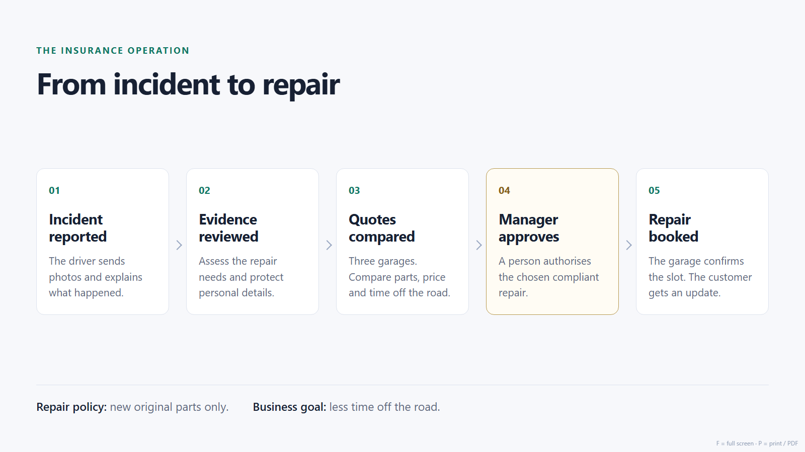
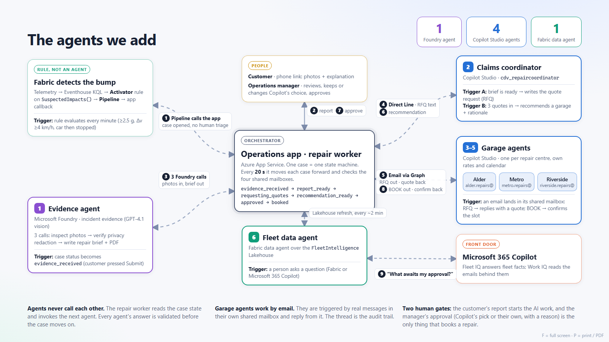
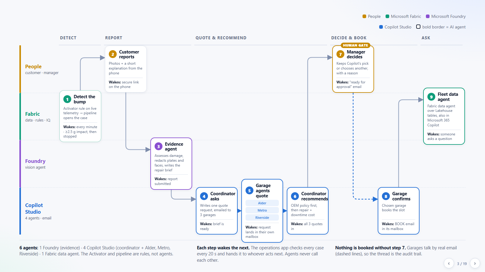
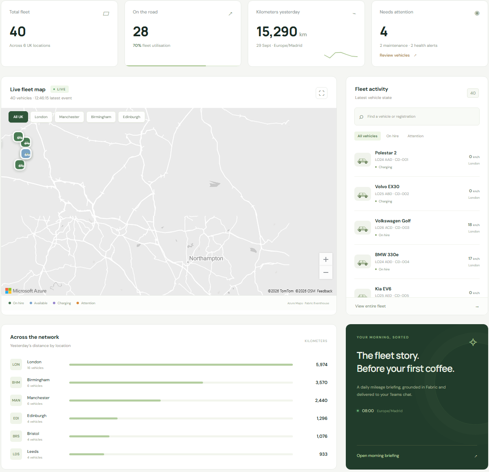

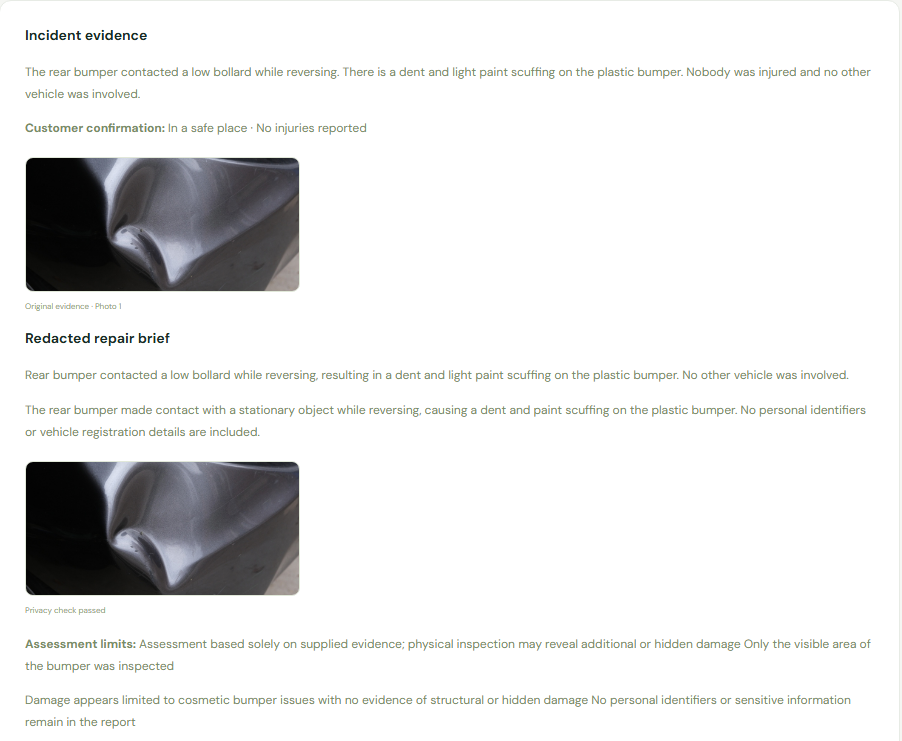
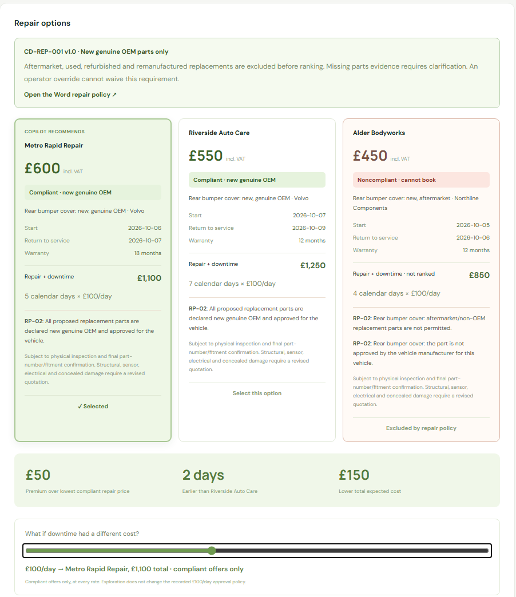
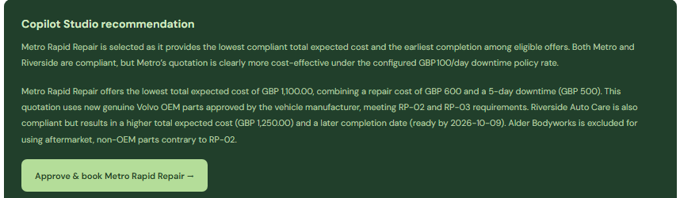
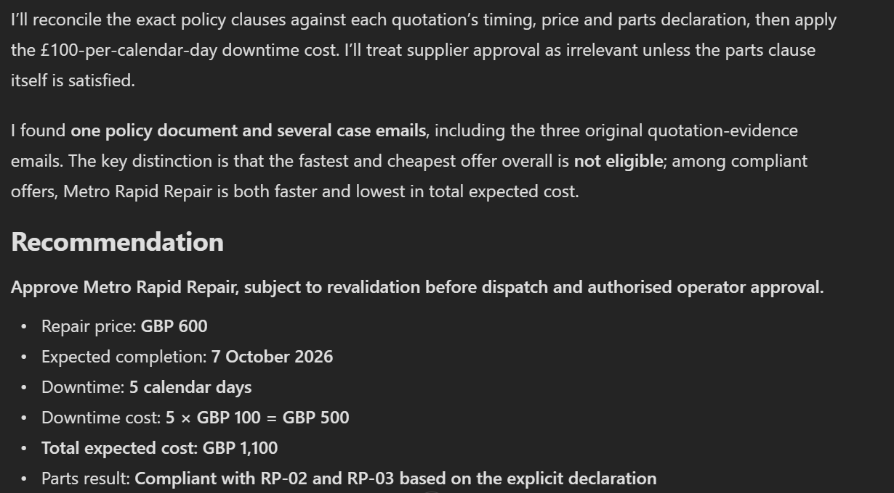
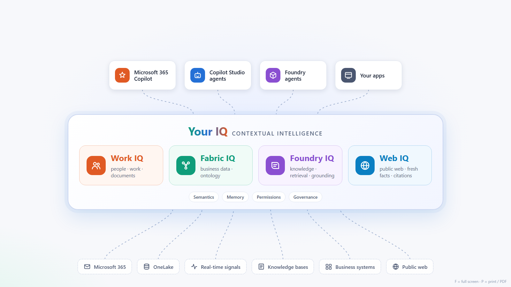

# Microsoft IQ for insurance: from incident to an accountable decision

**Sales narrative with screen-by-screen pitch and visuals**

**Audience:** insurance executives, claims leaders, architects and technical staff.  
**Length:** 12-15 minutes, followed by technical questions.  
**Opening sequence:** the business operation, the agents we add, then the product lanes.

## The pitch in 30 seconds

> "A minor vehicle incident can trigger a disproportionate amount of work: collecting evidence, chasing garages, checking parts and comparing repair dates. The opportunity is not simply to add a chatbot. It is to connect the facts, the policy and the people so the next decision arrives with the evidence already organised. Microsoft IQ provides that context; focused agents do the preparation; your people retain authority."

Three ideas should remain with the audience: **less coordination effort, better-informed repair decisions, and control that remains visible.**

The images below are actual presentation and demo captures, not mock-ups. Slide captures are current; application captures show recorded runs. The [capture register](#capture-register) identifies their dates and cases. Use the live application for current status.

---

## 1. Start with the operation, not the technology

**Time:** 1 minute. **Audience:** everyone.

**Open:** [Presentation, slide 1](https://wonderful-meadow-09d52640f.5.azurestaticapps.net/#1).

**Say:**

> "This is a familiar motor-repair process. An incident is reported, the evidence is reviewed, quotes are compared, a manager approves and a garage confirms the booking. The friction lives between those steps: incomplete information, repeated questions and decisions waiting in inboxes. We will keep the process recognisable and improve the work around each decision."

**Point to:** the five stages, the original-parts rule and the manager's approval. Establish the business goal before naming a product.

*Published presentation: the insurance operation, without company branding or technology labels.*

**Transition:** "Now let us add narrowly defined responsibilities to that operation."

## 2. Introduce the agents as useful business roles

**Time:** 1 minute. **Audience:** executives first; technical staff second.

**Open:** [Presentation, slide 2](https://wonderful-meadow-09d52640f.5.azurestaticapps.net/#2).

**Say:**

> "We are not introducing one agent with unlimited responsibility. An evidence agent prepares the repair brief. A coordinator requests and compares offers. Each garage supplies its own quotation and confirmation. A fleet assistant answers operational questions. These are focused roles around the people who remain accountable, not a replacement for the claims manager."

**Point to:** the evidence agent, coordinator, three garage agents and fleet data agent. Leave connection names and polling intervals for questions.

*Published presentation: the agent roles and their orchestration.*

**Technical cue:** the main journey uses one Foundry evidence agent, four Copilot Studio agents and one Fabric data agent. Telemetry detection is a rule and pipeline, not another AI agent. A separate customer-report agent is a presenter convenience, not part of this six-role pitch.

**Transition:** "Where should these responsibilities run, and where does each get its context?"

## 3. Put the roles into the Microsoft architecture

**Time:** 1 minute. **Audience:** both groups.

**Open:** [Presentation, slide 3: product lanes](https://wonderful-meadow-09d52640f.5.azurestaticapps.net/#3).

**Say:**

> "The lanes separate responsibilities. Fabric detects the operational signal and holds the business facts. Foundry handles the photographic evidence. Copilot Studio supports the repair correspondence and recommendation. The customer contributes evidence and the manager authorises the choice. The value is the connected process, with a clear boundary around every action."

**Point to:** the path across the lanes, then pause on the human approval gate. Do not read every box aloud.

*Published presentation: implementation responsibilities, not a claim that the agents call one another directly.*

**Technical cue:** an application worker coordinates the case. Native Studio agents are invoked through secured Direct Line channels; a Graph inbox adapter moves the actual emails. The ontology describes business relationships; application checks enforce booking eligibility.

**Transition:** "Let us follow one incident through that architecture."

## 4. Show that the incident belongs to a real operation

**Time:** 1 minute. **Audience:** executives.

**Open:** [Live fleet dashboard](https://caldovadrive08667473.azurewebsites.net/). Select a vehicle and inspect its state. For a predictable presentation, move next to the [prepared repair case](https://caldovadrive08667473.azurewebsites.net/#incidents?case=CDI-008FC82110).

**Say:**

> "A car is not just a claim reference. It belongs to a rental, a branch and a fleet whose availability matters. Here, vehicle signals arrive in Fabric and can open an incident for attention. The business context tells us which asset is affected and why its time off the road matters."

**Point to:** vehicle state, location and branch context. Do not quote the reference screenshot's mileage as today's live total.

*Recorded fleet interface, cropped to the operational content. Statistics are the captured snapshot.*

**Technical cue:** Eventhouse holds telemetry; Activator and a Data Factory pipeline open cases. Fabric IQ's ontology relates Vehicle, Rental, Branch, Incident and RepairQuotation. The published data agent currently queries the governed Lakehouse tables; it is not directly connected to the ontology as a source.

**Transition:** "The next step should be easy for the customer, not another administrative burden."

## 5. Make the customer interaction straightforward

**Time:** 45 seconds. **Audience:** executives and customer-experience leaders.

**Open:** the incident's **Open customer journey** view. Show the secure reporting page without submitting or replacing the prepared evidence.

**Say:**

> "The customer gets one clear next step: confirm they are safe, add photos and explain what happened. They do not need to reconstruct the vehicle details for several different teams. We collect the account once and use it to prepare the repair process."

**Point to:** safety confirmation and the photo-upload control.

*Recorded mobile intake interface; a separate capture of the customer experience, not a second photo set for the prepared repair case.*

**Technical cue:** the reporting link is expiring and capability-based. The phone message is a preview; the link, upload and consent flow are real. Unsafe or injury-related reports leave the routine procurement path for assistance.

**Transition:** "The insurer now has evidence. The next challenge is turning it into a useful, shareable brief."

## 6. Turn evidence into a decision-ready repair brief

**Time:** 1 minute. **Audience:** both groups.

**Open:** **Incident evidence** and **Repair brief PDF** in the [prepared case](https://caldovadrive08667473.azurewebsites.net/#incidents?case=CDI-008FC82110). If asked, open [Foundry](https://ai.azure.com/) and the configured evidence agent.

**Say:**

> "This is where an agent can remove preparation work. It reviews the customer's account and photograph, describes the visible damage and prepares a privacy-processed brief for the repair network. The manager can still inspect the source evidence and the assessment limits. A useful draft does not become a definitive diagnosis."

**Point to:** the original evidence, the separate repair brief and the assessment limits.

*Actual prepared case: evidence and repair brief, cropped without changing the content.*

**Technical cue:** this is **Foundry Agent Service**, not Foundry IQ retrieval. The workflow validates structured responses and records model-response provenance. This particular photo has no visible identity to mask, so the copies look similar; do not claim that it demonstrates a face or registration being removed.

**Transition:** "Now comes the decision that makes this more than a productivity demo."

## 7. The turning point: the fastest and cheapest offer is wrong

**Time:** 2 minutes. **Audience:** claims leadership, finance, risk and technology.

**Open:** **Repair options**. Show the Word policy link, the three offers and the downtime slider.

**Say:**

> "Alder is the tempting offer: the lowest price and the earliest return. But it proposes aftermarket parts, while this repair policy requires new original manufacturer parts. It is excluded before we optimise cost. Between the compliant offers, Metro costs GBP 50 more to repair the car but returns it two days earlier. At the stated downtime rate, that produces a GBP 150 lower expected total cost."

**Point to:** the red noncompliant card. Move the slider to zero: Riverside becomes the lowest-cost compliant choice. Return it to GBP 100: Metro wins. Alder remains ineligible at either rate.

*Actual comparison for case CDI-008FC82110; calendar downtime is measured from the recorded incident date.*

| Offer | Repair incl. VAT | Expected return | Calendar downtime | Repair + downtime at GBP 100/day | Eligible? |
| --- | ---: | --- | ---: | ---: | --- |
| Alder | GBP 450 | 6 October 2026 | 4 days | GBP 850 | No: aftermarket parts |
| Metro | GBP 600 | 7 October 2026 | 5 days | GBP 1,100 | Yes: new genuine OEM |
| Riverside | GBP 550 | 9 October 2026 | 7 days | GBP 1,250 | Yes: new genuine OEM |

**Business takeaway:** optimise the **eligible outcome**, not the cheapest isolated invoice. GBP 150 is the difference between two offers under the demo's stated downtime assumption, not a realised saving or an insurer-wide ROI claim.

**Technical cue:** RP-02 governs parts; RP-03 requires explicit declarations; RP-05 excludes noncompliant offers before ranking. Missing provenance requires clarification. Deterministic checks, not persuasive model prose, control eligibility.

**Transition:** "A recommendation is useful only if the right person can inspect it and control the commitment."

## 8. Keep authority with the manager

**Time:** 1 minute. **Audience:** executives and risk leaders.

**Open:** the recommendation and **Approve & book** control. Use the [separately completed case](https://caldovadrive08667473.azurewebsites.net/#incidents?case=CDI-EDB4612D4F) to show confirmation without consuming the prepared approval moment.

**Say:**

> "The manager receives the evidence, the alternatives and the reason for the recommendation together. They may choose another compliant offer with a recorded reason, but cannot waive the parts policy through an override. Approval authorises the request. The repair is only marked booked after the garage confirms those terms."

**Point to:** the approval button, then the separate approval and confirmation events in the completed case.

*Actual approval control, before a booking is authorised.*

**Technical cue:** the selected quote and policy are fingerprinted and rechecked before dispatch. The completed case recorded matching approved and confirmed quotation hashes. This is an auditable repair workflow, not autonomous coverage adjudication.

**Transition:** "Could a manager independently ask why this decision was made and see the original sources?"

## 9. Show Work IQ connecting policy to what the supplier actually said

**Time:** 2 minutes. **Audience:** everyone. This is the second key proof point.

**Open:** [The verified Microsoft 365 Copilot conversation](https://m365.cloud.microsoft/chat/conversation/da2d62d2-7c44-4d87-bad6-68aecbc648c0?auth=2&tenantId=b6883271-971b-4198-92a5-8ad615765572), with **Work IQ enabled**. Open the Word-policy citation and the supplier-email citations.

**Say:**

> "The policy is in a Word document. The supplier's commitment is in an email. Work IQ brings those pieces of work context into the answer, with citations. It identifies the same prohibited aftermarket offer and explains the compliant choice. This is not simply retrieving a price: it is connecting what the business requires with what the supplier actually offered."

**Ask in a new conversation if needed:**

> "Find repair policy CD-REP-001 v1.0 and the quotation-evidence emails for case CDI-008FC82110. Which offer is fastest and cheapest? Is it eligible? Recommend the best compliant option at GBP 100 per calendar downtime day. Cite the Word policy clauses and the original quotation emails."

*Actual Work IQ response excerpt. The saved conversation contains the Word and all three quotation-email citations; open them live rather than treating this cropped excerpt as the source evidence itself.*

**Technical cue:** Work IQ reasons over the operator's permission-aware Microsoft 365 context. The original supplier responses are preserved in quotation-evidence emails delivered to that operator. Fabric answers current operational-state questions; an older email describes what was communicated at that time.

**Transition:** "That combination of business facts and work context is the Microsoft IQ proposition."

## 10. Close on the platform opportunity, then propose a measurable pilot

**Time:** 1-2 minutes. **Audience:** executives, then the technical sponsor.

**Open:** [Microsoft IQ overview slide](https://wonderful-meadow-09d52640f.5.azurestaticapps.net/iq.html).

**Say:**

> "Microsoft IQ is the context layer, not another isolated chatbot. Fabric IQ provides business meaning and operational context. Work IQ connects the work around the decision. Foundry IQ is the route to reusable, permission-aware knowledge across a broader policy and document estate. The agents turn that context into prepared work. The business retains the controls."

*Platform overview. Foundry IQ and Web IQ are expansion paths in this pitch, not deployed retrieval paths in the demonstrated repair journey.*

**Close with:**

> "Let us start with one low-complexity motor-repair journey, one accountable process owner and one approved supplier cohort. We will baseline the handoffs, connect the agreed evidence and policy sources, and measure whether we reduce coordination effort and downtime without weakening control. Scale the pattern only after those measures justify it."

| Pilot measure | What to measure |
| --- | --- |
| Decision preparation | Time from complete customer evidence to a decision-ready pack |
| Operational effort | Manual touches and supplier-chasing effort per eligible case |
| Repair economics | Compliant repair cost plus the insurer's agreed downtime or replacement-vehicle cost |
| Policy control | Noncompliant selections blocked; missing declarations routed for clarification |
| Customer experience | Time to a clear next step; repeat requests for information |
| Grounding quality | Whether answers cite the correct policy version and relevant supplier evidence |

Agree targets with the insurer before the pilot. Do not extrapolate the single-case cost comparison into annual savings or promise a loss-ratio improvement.

---

## Technical questions to answer confidently

| Question | Answer for this demo |
| --- | --- |
| What is actually live? | Fabric telemetry and tables, ontology and graph, Foundry evidence processing, native Studio agents, real internal quotation/booking emails, operator approval, and Work IQ retrieval. |
| Is the ontology powering the chatbot directly? | The ontology and graph model the business relationships. The published data agent queries the governed Lakehouse tables used by that model; direct ontology-source attachment is not part of the current path. |
| Does Foundry IQ inspect the photo? | No. Foundry Agent Service runs the evidence agent. Foundry IQ is managed knowledge retrieval and a separate expansion discussion. |
| Does the Word document alone block a booking? | No. The Word policy and machine-readable policy share a controlled source. The application evaluates the structured parts declarations and revalidates the approved quote and policy. |
| Can an agent email a garage by itself? | The native agent returns validated content. The application sends and receives actual messages through scoped Graph mailbox access. This is not a native Outlook event-trigger integration. |
| Can the model approve an ineligible offer? | Its output is checked. The API rejects prohibited parts, including an attempted human override. No eligible offers means review, not a default winner. |
| Does this prove production claim-cycle reduction? | No. The prepared run reached a recommendation in 210.44 seconds; a separate run completed booking in 289.06 seconds using configured supplier offers and real services. They are demo execution timings, not production SLAs or comparative benchmarks. |
| What needs a production design? | Insurer-specific policies, claims-system integration, consent and retention, roles, supplier onboarding, operational resilience, evaluations, service availability and licensing for the selected capabilities. |

## Presenter preparation

Open the [deck at slide 1](https://wonderful-meadow-09d52640f.5.azurestaticapps.net/#1), the prepared repair case, the completed case and the verified Work IQ conversation in **the existing demo administrator's Work 2 browser profile**. Start with the business-process slide, then agent roles, then lanes; do not start in a cloud resource portal.

Confirm Fabric is active, the dashboard has fresh data, and the prepared quotation is still valid before the meeting. Inspect source citations and policy access. Do not click **Approve & book** while rehearsing if the same case must remain available for the live decision.

If a service is warming up or an answer is waiting for indexing, use the corresponding screenshot and describe it as a recorded run. Do not present a static capture as fresh telemetry, a live answer, or a newly confirmed booking.

For exact operational clicks and provisioning details, use the [operator walkthrough](storyline.md) and [implementation runbook](implementation.md). The spoken pitch above deliberately avoids the demo company's name.

## Capture register

All ten image files are stored alongside this document under `media/insurance-pitch/`. Application images are cropped only to remove navigation, company branding, unrelated account details and unused whitespace; no prices, results, agent answers or status labels were edited.

| Images | Source | Capture context |
| --- | --- | --- |
| 01-03 | Published business slide, agent overview and product lanes | Captured 4 October 2026 |
| 04 | Recorded fleet-dashboard screenshot | 30 September 2026; use current app values when live |
| 05 | Recorded customer-intake screenshot | 1 October 2026; interface reference, separate from the prepared case |
| 06-08 | Recorded hosted recommendation screenshot | Case CDI-008FC82110, captured 2 October 2026 UTC |
| 09 | Actual Microsoft 365 Copilot conversation | Same case; conversation `da2d62d2-7c44-4d87-bad6-68aecbc648c0`, captured 2 October 2026 UTC |
| 10 | Published Microsoft IQ overview slide | Captured 4 October 2026; platform framing |

The archived capture identities, dates and output shapes were checked against the saved browser and end-to-end receipts. No case was created, approved or booked to prepare this media story.

## Microsoft references

Product positioning checked on 4 October 2026:

- [Microsoft IQ: enterprise intelligence and shared organisational context](https://learn.microsoft.com/en-us/microsoft-iq/)
- [Fabric IQ: business data, semantic models and ontology](https://learn.microsoft.com/en-us/fabric/iq/overview)
- [Work IQ: permission-aware workplace intelligence](https://learn.microsoft.com/en-us/microsoft-365/copilot/extensibility/work-iq/)
- [Foundry IQ: managed knowledge bases and agentic retrieval](https://learn.microsoft.com/en-us/azure/foundry/agents/concepts/what-is-foundry-iq)
