# Caldova Drive: from a bump to a booked repair

## The story

**A rental customer has a minor bump while parking. Caldova detects the possible incident, helps the customer report it, obtains repair options, and prepares a recommendation. The operations manager reviews the evidence and approves the booking.**

The customer tells the story once. The insurer, rental operations team and repair centres work from the same case. The tempting offer is both cheapest and fastest, but proposes aftermarket parts. Caldova's Word repair policy requires new genuine OEM parts, so the agent must exclude that offer before comparing the compliant alternatives.

## The story at a glance

```mermaid
flowchart LR
    subgraph D["1 · Detect"]
        direction TB
        S1["1 · Car on the road<br/>live fleet map"] --> S2["2 · Bump while parking<br/>impact telemetry"] --> S3["3 · Fabric detects it<br/>Activator → Pipeline → Case"]
    end
    subgraph R["2 · Report"]
        direction TB
        S4["4 · Customer gets<br/>a secure link"] --> S5["5 · Photos +<br/>explanation"] --> S6["6 · Foundry writes<br/>the repair brief"]
    end
    subgraph X["3 · Decide"]
        direction TB
        S7["7 · Coordinator asks<br/>3 repair centres"] --> S8["8 · Three quotes,<br/>different trade-offs"] --> S9["9 · Agent recommends<br/>best business outcome"] --> S10["10 · Manager reviews<br/>the full case"] --> S11["11 · Manager approves"] --> S12["12 · Garage confirms"] --> S13["13 · Customer sees<br/>the next step"]
    end
    subgraph U["4 · Understand"]
        direction TB
        S14["14 · Ontology + graph<br/>one business model"] --> S15["15 · Fabric IQ<br/>what is true now"] --> S16["16 · Work IQ<br/>what was said and why"]
    end
    S3 --> S4
    S6 --> S7
    S13 --> S14

    classDef fabric fill:#117865,color:#fff,stroke:#0b5345
    classDef foundry fill:#6b2fa3,color:#fff,stroke:#4a1f72
    classDef studio fill:#0f6cbd,color:#fff,stroke:#0a4a82
    classDef app fill:#f3f2f1,color:#201f1e,stroke:#8a8886
    classDef m365 fill:#c43e1c,color:#fff,stroke:#8a2b13
    class S1,S2,S3,S14 fabric
    class S6 foundry
    class S7,S8,S9,S12 studio
    class S4,S5,S10,S11,S13 app
    class S15,S16 m365
```



**Colour key:** green = Microsoft Fabric · purple = Foundry evidence · blue = Copilot Studio repair agents · grey = app and people · orange = Microsoft 365 Copilot.

**Opening line:** “A car has a minor bump. In the next few minutes you'll see Fabric detect it, the customer report it once, AI agents collect and compare three repair quotes, and a manager approve the best option. Then we'll ask Copilot what's happening across the whole fleet, and why.”

This walkthrough uses the deployed **Microsoft Foundry** resource, project and evidence agent. The standalone Azure OpenAI account has been removed. Deployment and verification details are recorded in [implementation.md](implementation.md).

## Open these before presenting

Use **Edge Work 2**, signed in as `admin@caldova08667473.onmicrosoft.com` for the administration and employee experiences. The customer reporting page uses its own secure link and does not require a Microsoft 365 account.

| Window | Open |
| --- | --- |
| Operations dashboard | [Caldova Drive](https://caldovadrive08667473.azurewebsites.net) |
| Fabric | [Caldova Drive - Fleet Intelligence workspace](https://app.fabric.microsoft.com/groups/19b68e4b-dd12-4e74-84d9-18fd9f1e2b49/list?experience=fabric) |
| Foundry | [Microsoft Foundry](https://ai.azure.com) → resource **caldovadrive08667473-foundry** → project **caldova-insurance** → agent **caldova-incident-evidence** |
| Claims coordinator | [Repair coordinator in Copilot Studio](https://copilotstudio.microsoft.com/environments/Default-b6883271-971b-4198-92a5-8ad615765572/bots/02d7a04b-93fc-4cb3-b07c-49156794520c/overview) |
| Repair agent | [Metro Rapid Repair in Copilot Studio](https://copilotstudio.microsoft.com/environments/Default-b6883271-971b-4198-92a5-8ad615765572/bots/988bbfcb-a31e-4a36-8d4b-ea88da60f225/overview) |
| Email | [Outlook](https://outlook.office.com/mail/) → profile → **Open another mailbox** → `claims@caldova08667473.onmicrosoft.com` |
| Word repair policy | [Caldova Drive Repair Policy - CD-REP-001 v1.0](https://caldova08667473-my.sharepoint.com/personal/admin_caldova08667473_onmicrosoft_com/_layouts/15/Doc.aspx?sourcedoc=%7BC468D6E0-99AD-4D58-A4A5-8894BDF73578%7D&file=Caldova-Repair-Policy.docx&action=default&mobileredirect=true) |
| Microsoft 365 Copilot | [Caldova Microsoft 365 Copilot](https://m365.cloud.microsoft/chat/?auth=2&tenantId=b6883271-971b-4198-92a5-8ad615765572) |

For each fresh run, execute `.\.venv\Scripts\python.exe -m tools.reset_mini`. It deletes prior MINI cases, archives other journeys, and prepares one new Stornoway incident with no submitted report or photos. It verifies the application's actual initial email. Open the case URL and email subject printed by the command. Archived non-MINI cases remain accessible by their original links for read-only comparisons.

---

## 1. A customer is using a rental car

**Story:** Alex's green MINI Cooper is in Stornoway. Operations can see its location and connect it to the rental and home branch.

**Open and do:** Start on **Overview**. Show 39 cars **On hire**, one MINI **Incident detected**, and its Stornoway location. The portal does not contain charging or low-battery distractions. Optional: show Vehicle → Branch and Rental → Vehicle in the Fabric ontology; the full walkthrough is in [step 14](#14-show-the-ontology-behind-the-case).

**Feature:** Azure Maps; Fabric Eventhouse telemetry; Fabric IQ ontology and business context.

**Say:** “We are not looking at isolated GPS points. This car has a rental, a home branch and an operational state we understand.”

## 2. The customer has a bump while parking

**Story:** Alex catches the lower bumper on a bollard while reversing into a parking space. The vehicle records an impact signal and a sudden change in speed.

**Open and do:** In **Incident centre**, choose a vehicle without an active case and select **Send impact telemetry**. This injects an actual event into Fabric. To inspect the event, open the `CaldovaFleet` KQL database and run:

```kusto
VehicleImpacts
| top 5 by Timestamp desc
```

**Feature:** Telemetry ingestion into Fabric Real-Time Intelligence; timestamped vehicle events.

**Say:** “The vehicle has reported a possible impact. We have not yet decided that an accident occurred or that a claim is covered.”

## 3. Fabric detects the signal and starts the incident workflow

**Story:** Caldova's detection rule correlates the acceleration signal, velocity change and the vehicle coming to rest. It opens an incident for operations and prepares the customer reporting link.

**Open and do:** In Fabric, open **Caldova_Incident_Activator**. Show the running rule and its action. Then open **Caldova_Impact_Response** and its run history. Return to the dashboard as the new case appears.

The current rule checks:

- Peak acceleration of at least **2.5 g**.
- Velocity change of at least **4 km/h**.
- Speed after the event of at most **1 km/h**.

**Feature:** Fabric Activator conditions; a real Data Factory pipeline action; an authenticated application callback; incident correlation and deduplication.

**Say:** “Fabric turns the sensor event into an operational action. It opens the right case instead of sending someone an unstructured alert to investigate from scratch.”

**Presentation timing:** This configuration polls KQL every minute. A warm native trigger was verified at about 92 seconds; a cold pipeline run took longer than three minutes. Use that time to explain the detection rule or switch to the prepared fresh case for a shorter presentation. Delayed callbacks are reconciled rather than losing the incident.

## 4. The customer receives a clear next step

**Story:** The customer is contacted proactively, with emergency guidance and a simple way to report the incident.

**Open and do:** Open the demo administrator's inbox in [Outlook](https://outlook.office.com/mail/), which also represents the customer inbox for this presentation. Find **`[case reference] [REPORT] Your secure incident report link`**, sent automatically from the claims mailbox after detection. Show the actual email's safety guidance, vehicle reference and reporting link, then open that link.

The same email is retained in the incident's **The actual correspondence** section. **Open customer journey** still shows the phone-message preview with the same link as an alternative entry point.

Use a case marked **Awaiting customer report**. Do not select **Simulate customer report** first: that submits the form automatically, after which the reporting page shows confirmation rather than an editable form.

**Feature:** Event-driven customer engagement; real Microsoft 365 email; a secure, expiring incident link.

**Say:** “The first message is about safety and help, not a complicated claims form. The customer can report what happened when it is safe to do so.”

**Presenter detail:** The initial email is delivered to the explicitly configured demo inbox, not to addresses entered by a visitor. The phone message remains a preview; no real SMS is sent. Delivery receipts prevent repeated initial emails on every worker cycle.

## 5. The customer submits photos and an explanation

**Story:** Alex checks the prefilled contact details, adds a photo and describes what happened. The vehicle and Stornoway incident location are already identified.

**Open and do:** On the customer reporting page:

1. Review the editable name and email at the top: **Alex Morgan / alex.morgan@example.com**.
2. For the green MINI Cooper **CD-006**, upload **`media\crash1.png`**. Add **`media\crash2.png`** to show the wider scene with two faces and demonstrate privacy masking.
3. **What happened? starts empty.** Enter the customer's account in their own words, for example:

   > “I scraped the front bumper while parking. The photograph shows the affected area.”

4. Confirm permission to share the redacted repair brief, then submit. The confirmation ends at the case reference; there are no safety or assistance checkboxes.

**Feature:** Mobile evidence capture; prefilled case context; consent; protected uploads and evidence hashes.

The weather panel uses Web IQ to search public sources for weather context around the incident. It shows source links and the search time, does not claim an exact station observation, and never fills in the customer's explanation. Search results may not verify historical conditions at the incident time.

**Say:** “Alex tells the story once. We retain the original evidence securely and use a separate, privacy-processed version for the repair network.”

## 6. Foundry prepares the repair brief

**Story:** The evidence agent reviews the photos and customer account, identifies visible damage, checks image quality, and prepares a repair report with identifying details removed.

**Open and do:** In Foundry, open **caldova-insurance → Agents → caldova-incident-evidence**. Show its instructions and model configuration. In the dashboard, show **Incident evidence**, the privacy-processed photo and **Repair brief PDF**.

**Feature:** Microsoft Foundry Agent Service; multimodal reasoning; privacy redaction and verification; structured report output.

Face and text detectors place the masks using measured image coordinates before Foundry sees the image. Foundry does not guess mask positions. On a case awaiting evidence review, **Reprocess existing evidence** reruns the current pipeline while preserving the originals and previous assessment.

**Say:** “The agent assembles a useful case, but it does not decide liability, insurance coverage or whether the vehicle is safe to drive. It records what is visible and what still needs inspection.”

**Alternative branch:** For a separate inspection demonstration, use a fresh case with unclear or wider damage evidence. If Foundry routes it to **Evidence review required**, show that it has no quotation emails and cannot be approved automatically. The operator can request clearer evidence. Do not claim that the model has approved an image which it actually routed for review.

**Current MINI photo:** the real assessment redacted the plate and requested inspection because it identified possible fender involvement. Use that result to demonstrate review and privacy controls. For the later quotation comparison, open the existing prepared quote case; do not imply it is an approved assessment of the new MINI photo.

## 7. The claims coordinator asks three repair centres for quotes

**Story:** Before requesting quotes, the coordinator applies Caldova's repair policy. **RP-02** allows only new genuine OEM replacement parts; **RP-03** requires written parts evidence. The same privacy-cleared repair brief and policy go to all three approved centres.

**Open and do:** Open the Word policy and highlight RP-02, RP-03 and RP-05. In Copilot Studio, show the coordinator's instructions and supplied policy context. Then open **The actual correspondence** and the original `[RFQ]` Outlook messages with their repair brief and policy link.

**Feature:** Secured Studio agent generation, app-supplied controlled policy, and real Microsoft 365 email receipts.

**Say:** “The business rule lives in a real Word document. Being an approved supplier does not make every offer compliant: the centre must explicitly tell us what parts it proposes.”

**Implementation detail:** The application supplies policy, invokes the Studio agents and delivers validated messages. The retained Foundry repair functions are not the running path. This is not a native Outlook connector trigger.

## 8. The three centres respond with different trade-offs

**Story:** Alder is both cheapest and fastest, but proposes a new **aftermarket/non-OEM** bumper cover. Metro offers new genuine OEM parts with priority access. Riverside offers new genuine OEM parts at a lower repair price than Metro, but a later completion date.

**Open and do:** Show the three `[QUOTE]` replies. Open Metro in Copilot Studio to show its own rate and availability instructions. Each agent preserves its supplied offer exactly; the application validates and delivers the response.

| Centre | Agent | Shared mailbox |
| --- | --- | --- |
| Alder Bodyworks | Studio: `cdv_alderrepairs` | `alder.repairs@caldova08667473.onmicrosoft.com` |
| Metro Rapid Repair | Studio: `cdv_metrorepairs` | `metro.repairs@caldova08667473.onmicrosoft.com` |
| Riverside Auto Care | Studio: `cdv_riversiderepairs` | `riverside.repairs@caldova08667473.onmicrosoft.com` |

**Feature:** Real agent-to-workflow interaction, independently configured supplier responses, actual email threads and structured quote extraction.

**Say:** “Alder is a genuine commercial option, and its agent is honest about the parts. Aftermarket means a third-party replacement, not necessarily a counterfeit. But it is still outside our policy.”

**Presenter detail:** All three centres are represented inside Caldova. No outside garage is contacted.

## 9. The agent recommends the best business outcome

**Story:** The coordinator first excludes the aftermarket offer under RP-02 and RP-05. It then evaluates repair price plus calendar downtime only for compliant offers.

**Open and do:** Open **Repair options** on [CDI-008FC82110, Volvo EX30](https://caldovadrive08667473.azurewebsites.net/#incidents?case=CDI-008FC82110), deliberately left awaiting approval. The configured commercial offers are:

| Centre | Repair including VAT | Workshop lead + duration | Parts decision |
| --- | ---: | --- | --- |
| Alder Bodyworks | GBP 450 | 1 + 1 business days | Excluded: new aftermarket parts, RP-02 |
| **Metro Rapid Repair** | **GBP 600** | **2 + 1 business days** | **Eligible: new genuine OEM parts** |
| Riverside Auto Care | GBP 550 | 3 + 2 business days | Eligible: new genuine OEM parts |

In this prepared case, Alder returns on **6 October** for **GBP 850** including four downtime days, but is excluded. Metro returns on **7 October** for **GBP 1,100** including five downtime days. Riverside returns on **9 October** for **GBP 1,250** including seven downtime days. Metro is the best compliant choice.

Show the excluded card and its clause citation. Move the **downtime cost** slider to zero: Riverside becomes the lowest-cost compliant option, never Alder. Return to GBP 100: Metro wins among compliant options. Show the original supplier declaration below the card or in the actual email.

**Feature:** Policy-grounded agent recommendations; validated calculations; an interactive business trade-off.

**Say:** “Alder is faster and cheaper, but not eligible. Once we enforce the parts policy, the trade-off is Metro versus Riverside: GBP 50 extra repair spend for an earlier return. The slider explores costs; it cannot change the policy.”

**Important:** Calendar downtime includes weekends, while garage lead times and repair durations use business days. Use the current case's displayed dates and totals. Historical bookings keep their original recorded terms; old, unapproved quotes without parts declarations cannot be approved under the new policy.

## 10. The operations manager reviews one complete case

**Story:** The manager opens the fleet dashboard. Several cars need attention, but this one already has its evidence, correspondence and recommendation organised.

**Open and do:** From **Overview**, select the affected vehicle and open its incident, or use **Incident centre** directly. Review:

- Customer account and original photos.
- Privacy-processed report and PDF.
- The three RFQs and the actual responses.
- Side-by-side quotes and total expected cost.
- The agent's recommendation and the decision timeline.

**Feature:** A unified operations experience; evidence provenance; human-in-the-loop control.

**Say:** “The manager is not reconstructing the case from five different screens. Everything needed to judge the recommendation is here.”

## 11. The manager decides: accept or override

**Story:** After reviewing the case, the manager makes the call. Copilot pre-selects Metro. The manager can choose another **compliant** centre with a recorded reason, but cannot waive the OEM requirement.

**Open and do:** Point out that **Alder** cannot be selected. Click **Riverside** to show the legitimate override: a reason box appears (for example, “A spare car covers the downtime; choose the lower-price compliant repair”). Click back on **Metro** and select **Approve & book Metro**. Show the new `[BOOK]` email, including the exact approved parts declaration and no-substitution condition. If you choose Riverside, the case and operator booking email record the reason.

**Feature:** Explicit human approval; operator override with an audited reason; version and quote-validity checks; controlled execution. Fabric `Incidents` records `RecommendedGarage`, `ApprovedGarage`, `OverrodeRecommendation` and `OverrideReason`, so Fabric IQ can answer “Which cases did operators override, and why?”

**Say:** “The agent recommends. The manager decides between eligible offers. Neither a prompt nor an override reason can authorise prohibited parts.”

## 12. The garage confirms the booking

**Story:** Metro's agent receives the approved request and confirms the agreed terms. Only then does the case become booked.

**Open and do:** Wait for the `[BOOKED]` reply. Show **Booking confirmed**, the return date and the distinct approval and confirmation entries in the timeline.

**Feature:** Closed-loop agent orchestration; real email confirmation; durable workflow state.

**Say:** “Approval and confirmation are different facts. We only mark the repair as booked when the garage actually confirms it.”

## 13. The customer sees the next step

**Story:** Alex can see that the repair is booked and when the car is expected back, without repeating the incident report.

**Open and do:** Reload the customer's secure reporting page. Show the confirmed repair centre and expected return date. In the operator's mailbox, show the actual booking-confirmation notification.

**Feature:** Consistent customer and operations status; a persistent case across channels.

**Say:** “The customer, the repair centre and the operations team now share one clear next step.”

## 14. Show the ontology behind the case

**Story:** The manager has approved a repair for one car. The business also needs to know how that car relates to the rental, the branch, its mileage and the quotes. The ontology is the shared business model connecting those facts.

**Before presenting (one-off, 2 minutes):**

1. Open the [Fabric workspace](https://app.fabric.microsoft.com/groups/19b68e4b-dd12-4e74-84d9-18fd9f1e2b49/list?experience=fabric). In the item list, select **Caldova_Fleet_Digital_Twin** (type **Ontology**).
2. Check whether the top ribbon shows **Explore graph**. If it does not, select **Manage graph**. Keep **Use the entire Ontology** selected, then select **Continue** → **Materialize**. Materialization takes a few minutes.
3. After any data change, open the item **Caldova_Fleet_Digital_Twin_graph_…** (type **Graph model**). Select **Schedule** → **Refresh now** so the graph shows the latest cases.

**Open and do (live, about 3 minutes):**

1. **The business model.** Open **Caldova_Fleet_Digital_Twin**. The canvas opens in **Full ontology** view and shows seven entity types:
   - **Vehicle**, **Branch** and **Rental**
   - **VehicleState** (live snapshot), **DailyMileage**
   - **Incident** and **RepairQuotation**

   Then switch the canvas to **Relationship** view. In the **Explorer** on the left, select **Vehicle** to centre it. Point at its links: Vehicle → Branch, Rental → Vehicle, Incident → Vehicle, RepairQuotation → Incident, and VehicleState/DailyMileage → Vehicle.
2. **What a "Vehicle" means.** With **Vehicle** selected, choose **View Entity Type details** in the ribbon. Show three things:
   - The properties: Registration, Make, Model, Powertrain, DailyRateGBP and ServiceDueKm.
   - The entity type key, **VehicleId**.
   - The binding to the Lakehouse table **FleetIntelligence → Vehicles**.
3. **Real instances.** Open the **Instances** tab and find **CD-002**. This is the car in case CDI-168C31C660. These are live rows from OneLake, not a separate copy.
4. **Business rules.** Open **Incident** the same way and show the rule **RepairApproval** attached to it. ApprovalRecorded is not the same as BookingConfirmed. Then open **DailyMileage** and its rule **MileageAccounting**: kilometres come from DailyMileage.DistanceKm, never from odometer readings.
5. **The connected graph.** Go back to the ontology canvas and select **Explore graph** in the ribbon.
   - Select the puzzle piece icon on the right to expand **Components**.
   - Under **Nodes**, select Incident, Vehicle, Branch, Rental and RepairQuotation. Under **Edges**, select all the edges.
6. **One case, fully connected.** Select **Path query** in the ribbon and confirm **Switch**. Enter:
   - **Start node:** Incident, filter **CaseId = CDI-168C31C660**
   - **End node:** Branch
   - **Max hops:** 3

   Select **Run**. The canvas draws the incident → car CD-002 (Volvo EX30) → London Heathrow, plus rental R-10402 for Meridian Travel on that car. Add **RepairQuotation** to show the three repair offers (Alder, Metro, Riverside) linked to the same incident.

**Feature:** Fabric IQ ontology: entity types, entity keys, relationships, OneLake data bindings, business rules, and the materialized ontology graph (Graph in Microsoft Fabric).

**Say:** “The dashboard, the Fabric data agent and Copilot all use the same definitions of a vehicle, a rental, an incident and a quote. When we ask Copilot a question next, it is grounded in this model and its rules, not guessing which table means what.”

**If something does not load:** The Instances tab reads the Lakehouse live, so it works even if the graph is still refreshing. If **Explore graph** is missing, stay in **Relationship** view and the **Instances** tab. That still tells the full story.

## 15. Ask Fabric IQ about the live operation

**Story:** The manager wants to know what still needs attention across the fleet, not just in this one case.

**Open and do:** In Microsoft 365 Copilot, choose **Agents → Caldova Fleet IQ**. Ask:

> “Which repair cases currently await operator approval? Include the case IDs and recommended repair centre.”

Then:

> “Which cases have confirmed bookings, and what are their expected return dates?”

**Feature:** Fabric IQ business context and governed facts; the real Fabric data agent surfaced in Microsoft 365 Copilot.

**Say:** “Fabric answers the operational question: what is true in the fleet and case data right now?”

## 16. Ask Work IQ about the communication and reasoning

**Story:** The manager wants to know why the fastest, cheapest garage was rejected. The answer needs both company policy and the actual supplier's words, not just the fleet's numerical data.

**Open and do:** Switch to the main Microsoft 365 Copilot chat with **Work IQ enabled**, rather than staying inside the Fabric agent. Ask:

> “Find Caldova Drive Repair Policy CD-REP-001 v1.0 and the quotation-evidence emails for case CDI-008FC82110. Which offer is fastest and cheapest? Can we approve it under the parts policy? Compare the parts declarations, exclude noncompliant offers, and recommend the best compliant option using the recorded downtime cost. Cite the Word policy clauses and the quotation emails.”

Open both the Word-document citation and the quotation-email citation. The supplier originals are preserved unchanged in the operator's **Quotation evidence - Alder Bodyworks / Metro Rapid Repair / Riverside Auto Care** emails, with original sender, timestamp and Outlook link.

**Ready-to-present conversation:** In the operator's Copilot sidebar, open **Caldova Repair Policy Comparison**. This actual Work IQ response retrieved the Word policy and all three quotation-evidence emails, cited both source types, excluded Alder, and recommended Metro at GBP 1,100. The conversation ID is `da2d62d2-7c44-4d87-bad6-68aecbc648c0`.

**Feature:** Work IQ retrieval and reasoning over the operator's actual Microsoft 365 work context.

**Say:** “Work IQ connects our policy document to the actual supplier offer. It should identify Alder's aftermarket parts, cite RP-02 and RP-05, and compare only Metro and Riverside. The application enforces the same rule at approval and booking.”

Use Fabric for current case state and email for the recorded communication. An older recommendation email is not proof that a case is still awaiting approval.

Work IQ indexing is asynchronous. If the new document or emails are not yet retrieved, attach the existing Word file and relevant quotation emails using Copilot's file/context picker and rerun the question. Do not present a search miss or an answer without source citations as a verified policy comparison.

---

## The closing line

> “A customer had a bump. Before anyone had to piece the story together manually, Caldova had the vehicle context, the customer's evidence, three repair offers and a justified recommendation. A person approved the decision, the garage confirmed it, and every step remained traceable.”

## Prepared cases for the presentation

| Case | Open it for |
| --- | --- |
| [CDI-4170F5EC25](https://caldovadrive08667473.azurewebsites.net/#incidents?case=CDI-4170F5EC25) | Green MINI Cooper in Stornoway, CD-006; reporting email, editable contact prefills, empty explanation and weather context |
| [CDI-008FC82110](https://caldovadrive08667473.azurewebsites.net/#incidents?case=CDI-008FC82110) | Volvo EX30; OEM policy comparison, Work IQ question and live approval moment |
| [CDI-EDB4612D4F](https://caldovadrive08667473.azurewebsites.net/#incidents?case=CDI-EDB4612D4F) | Volkswagen Golf; completed genuine-OEM booking with matching approved/confirmed quotation fingerprints |
| [CDI-E277BBAC5C](https://caldovadrive08667473.azurewebsites.net/#incidents?case=CDI-E277BBAC5C) | Earlier completed Polestar booking; historical terms preserved |

For a fresh reporting journey, choose another vehicle without an incident. Earlier case IDs in the implementation history are archived verification records, not current prepared cases after the fleet reset.

Use a matching photograph for other cars. The supplied MINI picture and automatic customer-report action belong to CD-006 only.

## Product names to use accurately

| What is happening | Name to use |
| --- | --- |
| Detect a telemetry condition | **Fabric Real-Time Intelligence / Activator** |
| Relate vehicle, rental, incident and quotation facts | **Fabric IQ ontology and data bindings** |
| Analyse photos and prepare the privacy-processed report | **Microsoft Foundry Agent Service** |
| Generate RFQs, supplier replies and recommendations | **Copilot Studio agents with app-supplied policy and app-managed email** |
| Move and monitor the actual emails | **Microsoft Graph inbox adapter** |
| Ask questions over governed operational tables | **Fabric data agent / Caldova Fleet IQ** |
| Find and cite the operator's email context | **Work IQ in Microsoft 365 Copilot** |

The application's decision timeline is custom application functionality. Do not call it a native Fabric feature named “Evidence Map” or “Governed Binding”. Foundry Agent Service is not the same feature as Foundry IQ knowledge-base retrieval.
